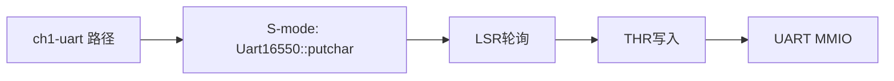

# 第一章扩展：S-Mode UART 输出最小内核

`tg-rcore-tutorial-ch1-uart` 基于 `tg-rcore-tutorial-ch1` 扩展，目标是让同学直观看到两种输出路径的差异：

- 普通 ch1：`S-mode -> SBI ecall -> M-mode -> UART`
- 本实验：`S-mode -> UART MMIO`

程序运行在 QEMU RISC-V 64 `virt` 平台，仍使用 `-bios none` 启动，打印 `Hello, world!` 后关机。

## 省流（先跑起来，再学原理）

### 30 秒快速上手

```bash
cd tg-rcore-tutorial-ch1-uart
cargo run
```

看到 `Hello, world!` 且 QEMU 退出，即说明环境和代码都已跑通。

### 2 分钟最小实验闭环

```bash
cd tg-rcore-tutorial-uart
cargo test

cd ../tg-rcore-tutorial-ch1-uart
./test.sh
```

### AI 协作建议

先让 AI 帮你确认“能跑起来”，再让 AI 按下面顺序讲解：

1. `_start -> rust_main -> panic_handler` 控制流
2. `SBI 输出` 与 `S-Mode UART 输出` 的调用链差异
3. `UART16550` 的 `LSR/THR` 寄存器意义

## 项目结构

```text
tg-rcore-tutorial-ch1-uart/
├── .cargo/
│   └── config.toml
├── build.rs
├── Cargo.toml
├── README.md
├── rust-toolchain.toml
├── test.sh
└── src/
    └── main.rs
```

配套组件：

- `../tg-rcore-tutorial-uart`：S-Mode UART16550 功能组件
- `../tg-rcore-tutorial-sbi`：`nobios` 启动与 `shutdown`

## 源码阅读导航索引

| 阅读顺序 | 位置 | 重点问题 |
|---|---|---|
| 1 | `src/main.rs::_start` | 为什么 UART 版本仍要保留裸机入口与手动设栈？ |
| 2 | `src/main.rs::rust_main` | 输出为何不再调用 `console_putchar`？ |
| 3 | `../tg-rcore-tutorial-uart/src/lib.rs::putchar_at` | 如何通过 LSR 轮询和 THR 写入完成串口发送？ |
| 4 | `src/main.rs::panic_handler` | no_std 下异常如何收口并关机？ |

## DoD 验收标准

- [ ] `cargo run` 能输出 `Hello, world!` 且正常退出
- [ ] 能说清输出路径从 `SBI ecall` 改为 `S-Mode MMIO`
- [ ] 能解释 `UART0_BASE=0x1000_0000`、`LSR[5]`、`THR` 的作用
- [ ] `tg-rcore-tutorial-uart` 单元测试通过
- [ ] `tg-rcore-tutorial-ch1-uart` 集成脚本测试通过

## 概念-源码-测试三联表

| 核心概念 | 源码入口 | 自测方式（命令/现象） |
|---|---|---|
| 裸机启动与手动设栈 | `tg-rcore-tutorial-ch1-uart/src/main.rs` 的 `_start` | `cargo run` 能稳定启动 |
| S-Mode UART 直接输出 | `tg-rcore-tutorial-uart/src/lib.rs` 的 `putchar_at` | `cargo test` 中 `putchar_writes_to_thr` 通过 |
| 最小内核主流程 | `tg-rcore-tutorial-ch1-uart/src/main.rs` 的 `rust_main` | 终端看到 `Hello, world!` |
| 异常收口 | `tg-rcore-tutorial-ch1-uart/src/main.rs` 的 `panic_handler` | 人为 panic 时异常关机 |

## 一、SBI 输出与 S-Mode UART 输出对比

### 1.1 调用链对比




### 1.2 核心差异

| 维度 | ch1 普通输出 | ch1-uart 输出 |
|---|---|---|
| 输出接口 | `tg_sbi::console_putchar` | `tg_uart::Uart16550::putchar` |
| 特权级路径 | S 态触发 ecall，M 态处理 | S 态直接 MMIO 访问 |
| 教学重点 | SBI 抽象与特权级切换 | 驱动寄存器与设备交互 |
| 代码位置 | `tg-rcore-tutorial-sbi/src/lib.rs` | `tg-rcore-tutorial-uart/src/lib.rs` |

### 1.3 什么是“可感可及”的差异

- 你可以在代码中直接看到 UART 地址和寄存器偏移，理解“字符到底写到了哪里”。
- 你可以逐步替换 `putchar` 实现，观察输出行为变化，建立“驱动代码 <-> 终端输出”直觉。
- 你可以把两种路径并排讲解，帮助同学理解“抽象接口”和“硬件细节”分别解决什么问题。

## 二、编译与运行

### 2.1 运行内核

```bash
cd tg-rcore-tutorial-ch1-uart
cargo run
```

预期输出：

```text
Hello, world!
```

### 2.2 运行测试

```bash
cd tg-rcore-tutorial-uart
cargo test

cd ../tg-rcore-tutorial-ch1-uart
./test.sh
```

## 三、代码实现细节

### 3.1 内核侧（ch1-uart）

- `_start`：设置栈并跳转 `rust_main`
- `rust_main`：调用 `Uart16550::qemu_virt().putstr("Hello, world!\n")`
- `panic_handler`：调用 `shutdown(true)` 收口

### 3.2 组件侧（uart）

- `UART0_BASE = 0x1000_0000`（QEMU virt UART0）
- `LSR` 偏移 `5`，`LSR[5]` 表示发送寄存器空
- `THR` 偏移 `0`，向 THR 写入字节触发发送

## 四、学习建议（先会跑，再会讲）

1. 先跑通命令，确认输出与关机行为。
2. 再看对比图，画出你自己的“调用链草图”。
3. 然后阅读两个 `rust_main` 实现，比较一行输出代码背后的系统路径。
4. 最后尝试让 AI 提问你：为什么本实验还能保留 `tg-sbi` 依赖。

## 五、扩展方向

- 为 `tg-rcore-tutorial-uart` 增加 `getchar` 与简单回显
- 在同一内核中提供“可切换输出后端”（SBI/UART）
- 增加对串口初始化流程的实验任务

## License

GPL-3.0
