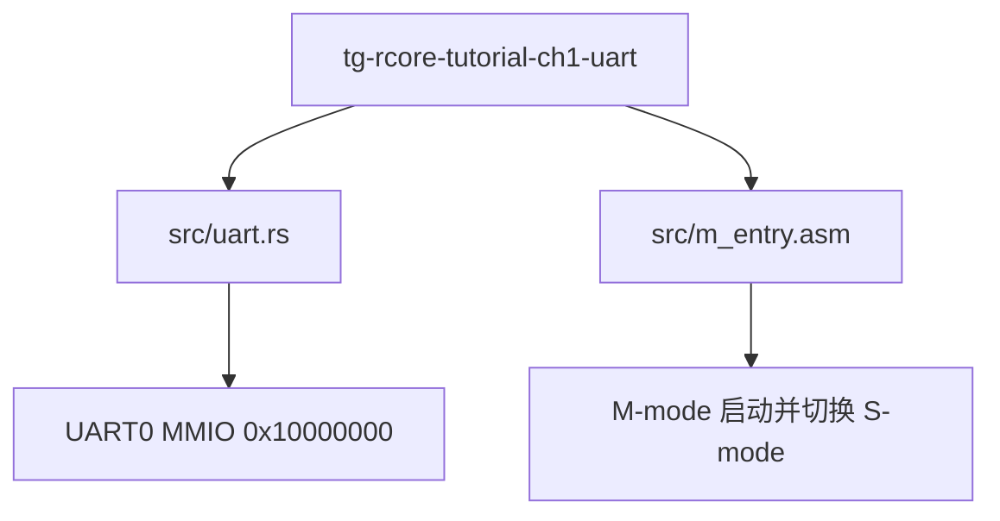
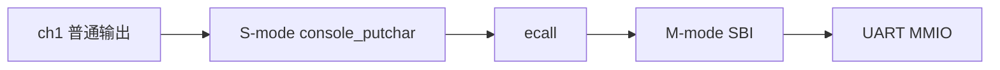

# ch1-uart 实验指导文档

## 0. 省流先跑（建议先做）

```bash
cd tg-rcore-tutorial-ch1-uart
cargo run
```

若终端输出 `Hello, world!` 且 QEMU 退出，说明你已经完成最关键的第一步：代码可运行、AI 可协作、环境可复现。

推荐学习顺序：

1. 先跑通命令
2. 再读“第 6 节：S-Mode 输出 vs 普通输出”
3. 最后按“第 7 节：面向同学的教学化讲解路径”组织自己的实验总结

## 1. 实验目标

- 扩展 `tg-rcore-tutorial-ch1`，形成 `tg-rcore-tutorial-ch1-uart` 极简内核 crate
- 让 ch1 内核不再通过 SBI 控制台输出字符，而是通过 S-Mode UART 驱动输出
- 在单 crate 内实现最小串口驱动与启动桥

## 2. 技术栈

- 编程语言：Rust
- 目标处理器：RISC-V 64（`riscv64gc-unknown-none-elf`）
- 硬件环境：QEMU RISC-V 64 `virt` 机器

## 3. 目录与模块关系



## 4. 核心改造点

### 4.1 内置串口驱动模块：`src/uart.rs`

- 提供 `init`、`putchar` 与 `puts` 方法
- 采用 MMIO 方式访问 UART16550：
  - 基址：`0x1000_0000`
  - 发送寄存器：`THR`（偏移 `0`）
  - 行状态寄存器：`LSR`（偏移 `5`）
  - 发送就绪位：`LSR[5]`

### 4.2 新增内核 crate：`tg-rcore-tutorial-ch1-uart`

- 保留 ch1 启动模型：`#![no_std]`、`#![no_main]`、裸机 `_start`
- 内置 `m_entry.asm`，在 M 态完成初始化后切换到 S 态
- `rust_main` 中调用 `uart::init()` 后输出 `Hello, world!\n`
- 通过写 QEMU test device 退出，不依赖 SBI

核心代码入口：

- `tg-rcore-tutorial-ch1-uart/src/main.rs`
- `tg-rcore-tutorial-ch1-uart/src/uart.rs`
- `tg-rcore-tutorial-ch1-uart/src/m_entry.asm`

## 5. 构建与运行

### 5.1 内核集成验证

```bash
cd tg-rcore-tutorial-ch1-uart
./test.sh
```

预期现象：

- 终端输出 `Hello, world!`
- QEMU 正常退出

## 6. 发布前检查（crates.io）

建议对该 crate 执行：

```bash
cargo fmt --all --check
cargo clippy --all-targets -- -D warnings
cargo package --allow-dirty
cargo publish --dry-run
```

建议核对：

- `Cargo.toml` 包含完整元信息：`name`、`version`、`description`、`license`、`repository`、`documentation`、`readme`、`keywords`、`categories`
- README 中包含用途、用法、测试方法
- 无本地路径泄漏到发布包中的不可用依赖

## 7. S-Mode 输出 vs 普通输出：原理与实现对比

### 7.1 调用链对比



```mermaid
flowchart LR
    A[ch1-uart S-Mode输出] --> B[S-mode uart::putchar]
    B --> C[轮询 LSR[5]]
    C --> D[写入 THR]
    D --> E[UART MMIO]
```

### 7.2 教学关注点对比

| 维度 | 普通 ch1 输出 | ch1-uart 输出 |
|---|---|---|
| 软件路径 | 依赖 SBI 控制台接口 | 直接驱动 UART 寄存器 |
| 硬件可见性 | 间接，重点在接口调用 | 直接，重点在寄存器语义 |
| 学习收益 | 理解特权级与 ABI | 理解设备驱动与 MMIO |
| 适合讲解的问题 | 为什么要有 SBI 抽象 | 为什么要轮询 LSR 再写 THR，如何通过 LSR[0] 读取输入 |

## 8. 面向同学的教学化讲解路径

建议按“可感可及”方式讲给同学：

1. 先展示同样一行 `Hello, world!`，但两条不同输出路径。
2. 再指出 ch1-uart 里可直接看到 `UART0_BASE`、`LSR`、`THR`，让同学知道字符写到了哪里。
3. 最后连接到 OS 概念：抽象层（SBI）解决可移植性，驱动层（UART MMIO）解决设备控制。

## 9. 验收清单

- [ ] `tg-rcore-tutorial-ch1-uart` 运行输出正确
- [ ] 输出路径已从 SBI 控制台切换为 S-Mode UART 驱动
- [ ] crate 可 `cargo publish --dry-run`
