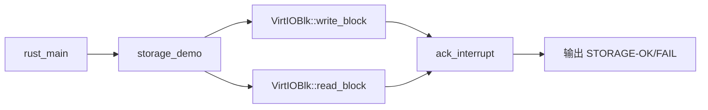

# tg-rcore-tutorial-ch1-storage

`tg-rcore-tutorial-ch1-storage` 在 `tg-rcore-tutorial-ch1` 基础上扩展了最小磁盘读写能力。内核在 S-Mode 直接驱动 VirtIO 块设备，完成一个块写入、读回校验、再恢复原块数据。

## 省流（先跑起来）

```bash
cd tg-rcore-tutorial-ch1-storage
bash test.sh
```

看到 `STORAGE-OK` 即表示磁盘读写闭环通过。

## 30 秒知道你会学到什么

- 学会在最小内核里初始化 VirtIO-BLK 并做扇区读写
- 学会把“写入→读回→校验→恢复”做成可验证闭环
- 学会读取并应答 VirtIO 设备中断状态寄存器

## 关键设计

- 设备：QEMU `virtio-blk-device`（MMIO `0x10001000`）
- 操作：写入块 `BLOCK_ID=8`，读回比较，再写回备份
- 中断机制：读写后读取并应答 VirtIO MMIO `interrupt status/ack`
- 启动：`-bios none`，沿用 ch1 的最小启动结构

## 调用链



## 运行

```bash
cd tg-rcore-tutorial-ch1-storage
if [ ! -f fs.img ]; then dd if=/dev/zero of=fs.img bs=1M count=16 status=none; fi
cargo run
```

预期输出包含：

```text
ch1-storage: start
irq_after_write=...
irq_after_read=...
STORAGE-OK
```

## 源码阅读导航

| 阅读顺序 | 位置 | 重点问题 |
|---|---|---|
| 1 | `src/main.rs::rust_main` | 最小启动后如何组织验证流程？ |
| 2 | `src/main.rs::storage_demo` | 为什么要先备份块、再恢复块？ |
| 3 | `src/main.rs::ack_interrupt` | 中断状态如何读取与应答？ |
| 4 | `src/main.rs::VirtioHal` | DMA 分配在 no_std 下怎么做？ |

## DoD 验收标准

- [ ] `cargo run` 输出 `STORAGE-OK`
- [ ] 输出中包含 `irq_after_write` 与 `irq_after_read`
- [ ] 测试块读回数据与写入数据一致
- [ ] 完成写回备份，镜像不被长期污染
- [ ] `bash test.sh` 自动化验证通过

## 常见问题

- `cargo run` 报磁盘参数错误：检查 `.cargo/config.toml` 是否包含 `-drive` 与 `virtio-blk-device`
- 输出 `STORAGE-FAIL`：优先确认 `fs.img` 可读写，或将 `BLOCK_ID` 改为其它非关键扇区重试
- 无中断状态输出：确认 QEMU 设备类型为 `virtio-mmio`，并检查 MMIO 基址是否为 `0x10001000`

## 文件结构

```text
tg-rcore-tutorial-ch1-storage/
├── .cargo/config.toml
├── build.rs
├── Cargo.toml
├── README.md
├── rust-toolchain.toml
├── test.sh
└── src/main.rs
```

## License

GPL-3.0
