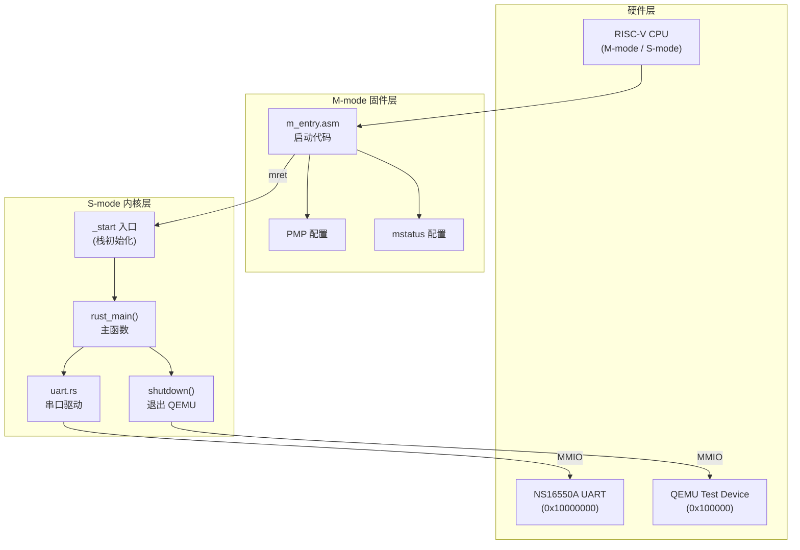
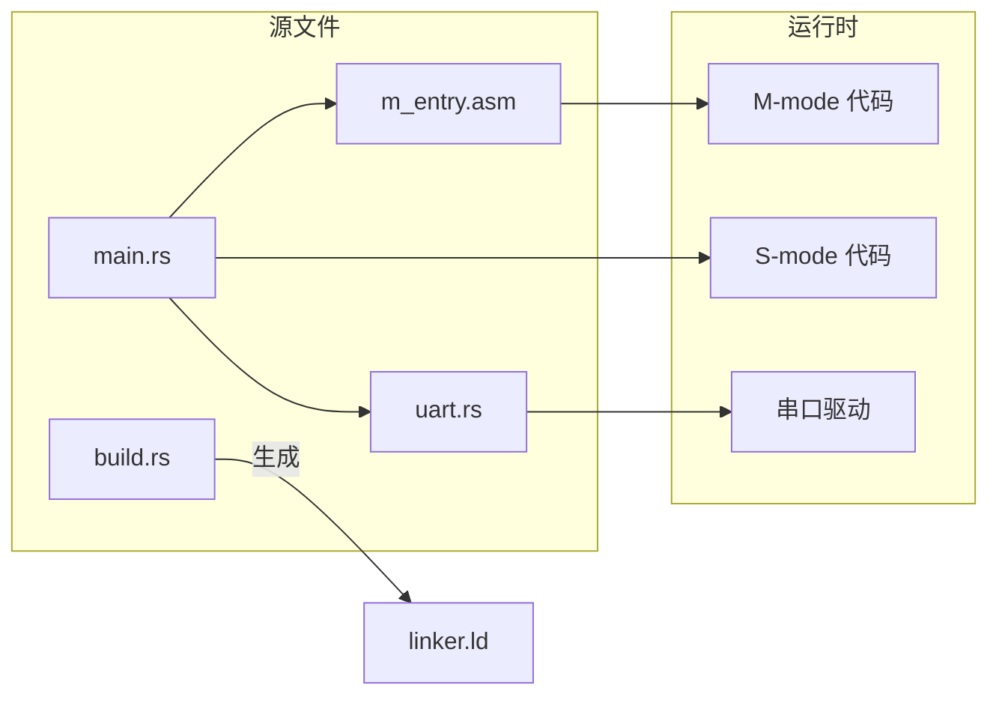
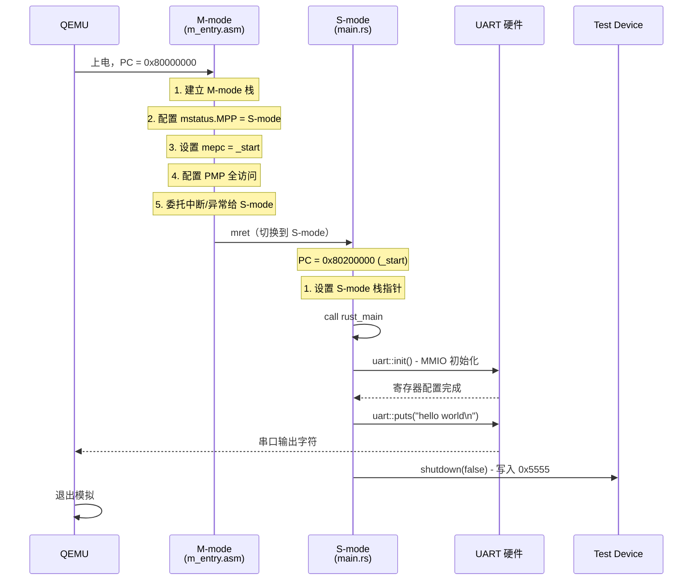

# tg-rcore-tutorial-ch1-uart2：裸机串口驱动内核

## 目录

- [1. 项目概述](#1-项目概述)
- [2. 整体架构设计](#2-整体架构设计)
- [3. 启动流程详解](#3-启动流程详解)
- [4. 内存布局](#4-内存布局)
- [5. 串口驱动设计与实现](#5-串口驱动设计与实现)
- [6. 构建系统](#6-构建系统)
- [7. 动手实践](#7-动手实践)

---

## 1. 项目概述

### 1.1 项目目标

本项目是一个**最小化的裸机操作系统内核**，运行在 QEMU RISC-V 64 位虚拟平台（virt machine）上。核心目标是：

> 在 **不依赖 SBI（Supervisor Binary Interface）** 的情况下，直接通过 **MMIO（Memory-Mapped I/O）** 操作 NS16550A 串口硬件，输出 "hello world" 字符串。

### 1.2 为什么需要这个项目？

传统方式下，RISC-V S-mode 内核通过 SBI 调用（类似于系统调用）请求 M-mode 的固件（如 OpenSBI）来完成 I/O 操作。但在深入理解操作系统的道路上，我们需要了解：

1. **硬件是如何被软件直接控制的**
2. **CPU 是如何从 M-mode 切换到 S-mode 的**
3. **设备驱动程序的基本结构是什么**

本项目正是回答这些问题的最佳实践。

### 1.3 项目特点

```
┌─────────────────────────────────────────────────────────────┐
│                     项目特点一览                             │
├─────────────────┬───────────────────────────────────────────┤
│ 运行模式        │ -bios none（无 SBI 固件）                  │
│ 特权级          │ M-mode → S-mode                           │
│ I/O 方式        │ MMIO（直接内存映射 I/O）                   │
│ 串口硬件        │ NS16550A 兼容 UART                        │
│ 波特率          │ 115200 bps                               │
│ 帧格式          │ 8N1（8位数据，无校验，1位停止位）          │
│ 编程语言        │ Rust + 汇编                              │
└─────────────────┴───────────────────────────────────────────┘
```

---

## 2. 整体架构设计

### 2.1 系统分层架构



### 2.2 模块依赖关系



### 2.3 文件结构说明

```
tg-rcore-tutorial-ch1-uart2/
├── Cargo.toml                 # Rust 项目配置
├── rust-toolchain.toml        # 工具链版本锁定
├── build.rs                   # 构建脚本（生成链接脚本）
├── .cargo/
│   └── config.toml            # Cargo 配置（目标平台、QEMU 参数）
└── src/
    ├── main.rs                # S-mode 内核入口
    ├── uart.rs                # NS16550A 串口驱动
    └── m_entry.asm            # M-mode 启动汇编代码
```

---

## 3. 启动流程详解

### 3.1 完整启动时序



### 3.2 M-mode 启动代码解析

当 QEMU 以 `-bios none` 启动时，CPU 从地址 `0x80000000` 开始执行，处于 **M-mode（Machine Mode）**。`m_entry.asm` 完成以下工作：

```
┌─────────────────────────────────────────────────────────────────┐
│                    M-mode 启动流程                               │
├─────────────────────────────────────────────────────────────────┤
│                                                                 │
│  0x80000000: _m_start                                          │
│       │                                                         │
│       ▼                                                         │
│  ┌─────────────────────────────────────┐                       │
│  │ 1. 建立 M-mode 专用栈               │                       │
│  │    la   sp, m_stack_top            │                       │
│  │    csrw mscratch, sp               │                       │
│  └─────────────────────────────────────┘                       │
│       │                                                         │
│       ▼                                                         │
│  ┌─────────────────────────────────────┐                       │
│  │ 2. 配置 mstatus                     │                       │
│  │    MPP=01（返回到 S-mode）          │                       │
│  │    li   t0, (1 << 11)              │                       │
│  │    csrw mstatus, t0                │                       │
│  └─────────────────────────────────────┘                       │
│       │                                                         │
│       ▼                                                         │
│  ┌─────────────────────────────────────┐                       │
│  │ 3. 设置返回地址                     │                       │
│  │    la   t0, _start                 │                       │
│  │    csrw mepc, t0                   │                       │
│  └─────────────────────────────────────┘                       │
│       │                                                         │
│       ▼                                                         │
│  ┌─────────────────────────────────────┐                       │
│  │ 4. 配置中断/异常委托                │                       │
│  │    csrw mideleg, 0xffff            │                       │
│  │    csrw medeleg, 0xffff            │                       │
│  └─────────────────────────────────────┘                       │
│       │                                                         │
│       ▼                                                         │
│  ┌─────────────────────────────────────┐                       │
│  │ 5. 配置 PMP（物理内存保护）         │                       │
│  │    pmpaddr0 = -1（全地址空间）      │                       │
│  │    pmpcfg0  = 0x0f（TOR + RWX）    │                       │
│  └─────────────────────────────────────┘                       │
│       │                                                         │
│       ▼                                                         │
│  ┌─────────────────────────────────────┐                       │
│  │ 6. 允许 S-mode 读取性能计数器       │                       │
│  │    csrw mcounteren, -1             │                       │
│  └─────────────────────────────────────┘                       │
│       │                                                         │
│       ▼                                                         │
│  ┌─────────────────────────────────────┐                       │
│  │ 7. mret 跳转到 S-mode               │                       │
│  │    → PC = mepc = _start            │                       │
│  │    → 特权级 = S-mode               │                       │
│  └─────────────────────────────────────┘                       │
│                                                                 │
└─────────────────────────────────────────────────────────────────┘
```

### 3.3 关键 CSR 寄存器说明

```
┌─────────────────────────────────────────────────────────────────────┐
│                    mstatus 寄存器布局                                │
├─────┬─────┬─────┬─────┬─────┬─────┬────────────────────────────────┤
│ Bit │ 12  │ 11  │ 10  │ 9   │ 8   │ 说明                           │
├─────┼─────┼─────┼─────┼─────┼─────┼────────────────────────────────┤
│     │ MPP[1] MPP[0] │ FS  │ MIE │ MPIE│                               │
│     │     ↓     ↓   │     │     │     │                              │
│     │     0     1   │     │     │     │ ← 我们设置 MPP=01 (S-mode)  │
└─────┴─────┴─────┴─────┴─────┴─────┴────────────────────────────────┘

MPP (Machine Previous Privilege) 值：
  00 = User mode (U-mode)
  01 = Supervisor mode (S-mode)  ← 我们使用这个
  11 = Machine mode (M-mode)
```

---

## 4. 内存布局

### 4.1 物理内存映射

```
物理地址空间布局
┌────────────────────────────────────────────────────────────────────┐
│ 地址              │ 内容                │ 说明                      │
├───────────────────┼─────────────────────┼───────────────────────────┤
│ 0x0000_0000       │ ROM/Boot ROM        │（-bios none 时不存在）    │
│        ~          │                     │                           │
│ 0x0010_0000       │ VIRT_TEST           │ QEMU 退出控制寄存器       │
├───────────────────┼─────────────────────┼───────────────────────────┤
│ 0x1000_0000       │ UART0               │ NS16550A 串口基地址       │
│        ~          │                     │                           │
├───────────────────┼─────────────────────┼───────────────────────────┤
│ 0x8000_0000       │ M-mode 区域         │ M-mode 代码和数据         │
│                   │   .text.m_entry     │   - M-mode 启动代码       │
│                   │   .text.m_trap      │   - M-mode 陷阱处理       │
│                   │   .bss.m_stack      │   - M-mode 栈 (4KB)       │
│                   │   .bss.m_data       │   - M-mode 数据           │
├───────────────────┼─────────────────────┼───────────────────────────┤
│ 0x8020_0000       │ S-mode 区域         │ S-mode 内核               │
│                   │   .text.entry       │   - _start 入口           │
│                   │   .text             │   - 内核代码              │
│                   │   .rodata           │   - 只读数据              │
│                   │   .data             │   - 可读写数据            │
│                   │   .bss              │   - 未初始化数据 + 栈     │
└───────────────────┴─────────────────────┴───────────────────────────┘
```

### 4.2 内核镜像结构

```
内核镜像在内存中的布局
                  物理地址
                    │
    0x80000000 ─────┼────────────────────────────────────
                    │  ┌─────────────────────────────┐
                    │  │  .text.m_entry              │
                    │  │  M-mode 启动代码            │
                    │  │  (~52 bytes)                │
                    │  └─────────────────────────────┘
                    │
    0x80000040 ─────┼────────────────────────────────────
                    │  ┌─────────────────────────────┐
                    │  │  .bss.m_stack               │
                    │  │  M-mode 栈 (4096 bytes)     │
                    │  └─────────────────────────────┘
                    │
                    │  ... (对齐填充) ...
                    │
    0x80200000 ─────┼────────────────────────────────────
                    │  ┌─────────────────────────────┐
                    │  │  .text.entry                │
                    │  │  S-mode 入口 _start         │
                    │  │  (naked 函数，设置栈)       │
                    │  ├─────────────────────────────┤
                    │  │  .text                      │
                    │  │  rust_main                  │
                    │  │  uart::init / puts          │
                    │  │  shutdown                   │
                    │  │  panic_handler              │
                    │  ├─────────────────────────────┤
                    │  │  .rodata                    │
                    │  │  字符串字面量               │
                    │  │  "hello world\n"            │
                    │  ├─────────────────────────────┤
                    │  │  .bss.uninit                │
                    │  │  S-mode 栈 (4096 bytes)     │
                    │  └─────────────────────────────┘
                    │
                    ▼
```

---

## 5. 串口驱动设计与实现

### 5.1 NS16550A UART 简介

NS16550A 是一款经典的 UART（Universal Asynchronous Receiver-Transmitter，通用异步收发器）控制器，广泛用于串口通信。QEMU virt 平台模拟了一个 NS16550A 兼容的 UART，映射到物理地址 `0x1000_0000`。

### 5.2 寄存器布局

```
UART 寄存器映射 (基址: 0x1000_0000)
┌────────┬─────────────────┬─────────────────┬─────────────────────────┐
│ 偏移   │ DLAB=0 读       │ DLAB=0 写       │ DLAB=1                  │
├────────┼─────────────────┼─────────────────┼─────────────────────────┤
│ +0     │ RBR             │ THR             │ DLL                     │
│        │ 接收缓冲寄存器   │ 发送保持寄存器   │ 波特率除数低字节         │
├────────┼─────────────────┼─────────────────┼─────────────────────────┤
│ +1     │ IER             │ IER             │ DLM                     │
│        │ 中断使能寄存器   │                 │ 波特率除数高字节         │
├────────┼─────────────────┼─────────────────┼─────────────────────────┤
│ +2     │ IIR             │ FCR             │ (同左)                  │
│        │ 中断标识寄存器   │ FIFO 控制寄存器 │                         │
├────────┼─────────────────┼─────────────────┼─────────────────────────┤
│ +3     │ LCR             │ LCR             │                         │
│        │ 线路控制寄存器   │                 │                         │
├────────┼─────────────────┼─────────────────┼─────────────────────────┤
│ +4     │ MCR             │ MCR             │                         │
│        │ 调制解调器控制   │                 │                         │
├────────┼─────────────────┼─────────────────┼─────────────────────────┤
│ +5     │ LSR             │ —               │                         │
│        │ 线路状态寄存器   │                 │                         │
└────────┴─────────────────┴─────────────────┴─────────────────────────┘

DLAB (Divisor Latch Access Bit): LCR 寄存器的第 7 位
  DLAB=0: 访问 RBR/THR/IER（正常操作模式）
  DLAB=1: 访问 DLL/DLM（设置波特率模式）
```

### 5.3 关键寄存器详解

#### 5.3.1 LCR (Line Control Register) - 线路控制寄存器

```
LCR 寄存器位定义
┌─────┬─────┬─────┬─────┬─────┬─────┬─────┬─────┐
│ Bit │  7  │  6  │  5  │  4  │  3  │  2  │1:0  │
├─────┼─────┼─────┼─────┼─────┼─────┼─────┼─────┤
│     │DLAB │ SBC │ SP  │ EPS │ PEN │ STB │ WLS │
└─────┴─────┴─────┴─────┴─────┴─────┴─────┴─────┘

我们使用的值: 0x03 (8N1) 或 0x80 (设置波特率)

字段说明：
  DLAB: 除数锁存访问位
    0 = 正常 RBR/THR/IER 访问
    1 = 访问 DLL/DLM（波特率除数）
  
  WLS (Word Length Select): 字长
    00 = 5 bits
    01 = 6 bits
    10 = 7 bits
    11 = 8 bits  ← 我们使用 8 位

  STB (Stop Bits): 停止位
    0 = 1 stop bit  ← 我们使用 1 位
    1 = 2 stop bits (5位字长时为 1.5)

  PEN (Parity Enable): 校验使能
    0 = 无校验  ← 我们不使用校验
    1 = 有校验

8N1 配置: LCR = 0b00000011 = 0x03
  - 8 位数据
  - 无校验 (Parity = None)
  - 1 位停止位
```

#### 5.3.2 LSR (Line Status Register) - 线路状态寄存器

```
LSR 寄存器位定义
┌─────┬─────┬─────┬─────┬─────┬─────┬─────┬─────┬─────┐
│ Bit │  7  │  6  │  5  │  4  │  3  │  2  │  1  │  0  │
├─────┼─────┼─────┼─────┼─────┼─────┼─────┼─────┼─────┤
│     │ RFE │ TEMT│ THRE│ BI  │ FE  │ PE  │ OE  │ DR  │
└─────┴─────┴─────┴─────┴─────┴─────┴─────┴─────┴─────┘

我们主要使用：THRE (Bit 5)

关键字段：
  THRE (Transmit Holding Register Empty): 发送保持寄存器空
    0 = THR 有数据，不能写入新数据
    1 = THR 为空，可以写入新数据  ← 等待这个位变成 1

  TEMT (Transmitter Empty): 发送器空
    1 = THR 和移位寄存器都为空

  DR (Data Ready): 数据就绪
    1 = RBR 中有接收到的数据
```

#### 5.3.3 FCR (FIFO Control Register) - FIFO 控制寄存器

```
FCR 寄存器位定义（只写）
┌─────┬─────┬─────┬─────┬─────┬─────┬─────┬─────┬─────┐
│ Bit │  7  │  6  │  5  │  4  │  3  │  2  │  1  │  0  │
├─────┼─────┼─────┼─────┼─────┼─────┼─────┼─────┼─────┤
│     │  RTL[1:0]  │  0  │  0  │ DMA │ XMIT│ RCV │ EN  │
│     │           │     │     │ MODE│ RST │ RST │     │
└─────┴───────────┴─────┴─────┴─────┴─────┴─────┴─────┘

我们使用的值: 0xC7

字段说明：
  EN (Bit 0): FIFO 使能
    1 = 使能 FIFO  ← 使能

  RCV RST (Bit 1): 接收 FIFO 复位
    1 = 清空接收 FIFO  ← 复位

  XMIT RST (Bit 2): 发送 FIFO 复位
    1 = 清空发送 FIFO  ← 复位

  RTL (Bits 7:6): 接收触发级别
    00 = 1 字节
    01 = 4 字节
    10 = 8 字节
    11 = 14 字节  ← 设置为 14 字节

0xC7 = 0b11000111:
  - 使能 FIFO
  - 复位接收 FIFO
  - 复位发送 FIFO
  - 触发阈值 14 字节
```

### 5.4 波特率计算

```
波特率除数计算
┌────────────────────────────────────────────────────────────────┐
│                                                                │
│  公式: Divisor = UART_CLK / (16 × Baud_Rate)                   │
│                                                                │
│  QEMU virt 平台参数:                                           │
│    UART_CLK  = 3,686,400 Hz (3.6864 MHz)                      │
│    Baud_Rate = 115,200 bps                                    │
│                                                                │
│  计算:                                                         │
│    Divisor = 3,686,400 / (16 × 115,200)                       │
│           = 3,686,400 / 1,843,200                             │
│           = 2                                                 │
│                                                                │
│  因此:                                                         │
│    DLL = 0x02 (低字节)                                         │
│    DLM = 0x00 (高字节)                                         │
│                                                                │
└────────────────────────────────────────────────────────────────┘
```

### 5.5 初始化序列

```mermaid
flowchart TD
    START[开始初始化] --> STEP1[1. 禁用中断<br/>IER = 0x00]
    STEP1 --> STEP2[2. 进入波特率设置模式<br/>LCR = 0x80 (DLAB=1)]
    STEP2 --> STEP3[3. 设置波特率除数<br/>DLL = 0x02, DLM = 0x00]
    STEP3 --> STEP4[4. 设置帧格式 8N1<br/>LCR = 0x03 (DLAB=0)]
    STEP4 --> STEP5[5. 配置 FIFO<br/>FCR = 0xC7]
    STEP5 --> STEP6[6. 配置调制解调器<br/>MCR = 0x0B]
    STEP6 --> STEP7[7. 清除挂起状态<br/>读取 LSR 和 RBR]
    STEP7 --> DONE[初始化完成]
```

### 5.6 字符发送流程

```
发送一个字符的流程 (putchar)
┌─────────────────────────────────────────────────────────────────┐
│                                                                 │
│  putchar(c)                                                     │
│       │                                                         │
│       ▼                                                         │
│  ┌─────────────────────────────────┐                           │
│  │ 读取 LSR 寄存器                 │                           │
│  │ lsr = read_reg(LSR)            │                           │
│  └─────────────────────────────────┘                           │
│       │                                                         │
│       ▼                                                         │
│  ┌─────────────────────────────────┐                           │
│  │ LSR.THRE == 1 ?                 │                           │
│  │ (发送保持寄存器是否为空)         │                           │
│  └─────────────────────────────────┘                           │
│       │                                                         │
│       ├── 否 ──► 循环等待（忙等待）────────────┐               │
│       │                                        │               │
│       ▼ 是                                     │               │
│  ┌─────────────────────────────────┐          │               │
│  │ 写入 THR 寄存器                  │          │               │
│  │ write_reg(THR, c)               │          │               │
│  └─────────────────────────────────┘          │               │
│       │                                        │               │
│       ▼                                        │               │
│  [字符被 UART 硬件发送]                        │               │
│       │                                        │               │
│       ▼                                        │               │
│  [返回] ◄──────────────────────────────────────┘               │
│                                                                 │
└─────────────────────────────────────────────────────────────────┘
```

### 5.7 MMIO 操作原理

```
内存映射 I/O (MMIO) 示意图
┌─────────────────────────────────────────────────────────────────┐
│                         CPU                                     │
│  ┌───────────────────────────────────────────────────────────┐ │
│  │  Rust 代码                                                 │ │
│  │                                                           │ │
│  │  // 写入 UART 的 THR 寄存器                                │ │
│  │  (0x10000000 as *mut u8).write_volatile(byte);            │ │
│  │       │                                                   │ │
│  │       │ 指针解引用 + volatile 写                          │ │
│  │       ▼                                                   │ │
│  └───────┼───────────────────────────────────────────────────┘ │
│          │                                                      │
│          ▼                                                      │
│  ┌───────────────────────────────────────────────────────────┐ │
│  │              CPU 内存控制器 / 总线                         │ │
│  │                                                           │ │
│  │  检测到地址 0x10000000                                    │ │
│  │  → 这是一个 MMIO 地址，不访问 RAM                         │ │
│  │  → 路由到 UART 设备                                       │ │
│  └───────────────────────────────────────────────────────────┘ │
│          │                                                      │
│          ▼                                                      │
│  ┌───────────────────────────────────────────────────────────┐ │
│  │              UART 硬件 (NS16550A)                          │ │
│  │                                                           │ │
│  │  ┌─────┬─────┬─────┬─────┬─────┬─────┐                   │ │
│  │  │ RBR │ IER │ IIR │ LCR │ MCR │ LSR │                   │ │
│  │  │ THR │     │ FCR │     │     │     │                   │ │
│  │  └─────┴─────┴─────┴─────┴─────┴─────┘                   │ │
│  │     ↑                                                     │ │
│  │     │                                                     │ │
│  │  写入 THR → 字符进入发送队列 → 串口输出                    │ │
│  └───────────────────────────────────────────────────────────┘ │
│                                                                 │
└─────────────────────────────────────────────────────────────────┘

为什么使用 write_volatile / read_volatile？
  1. 防止编译器优化：MMIO 操作不能被优化掉
  2. 保证执行顺序：编译器不会重排 volatile 操作
  3. 每次都真正访问内存：不会使用寄存器缓存
```

---

## 6. 构建系统

### 6.1 构建流程


### 6.2 链接脚本解析

链接脚本由 `build.rs` 在编译时生成，定义了内存布局：

```ld
# 链接脚本核心结构

OUTPUT_ARCH(riscv)           # 目标架构：RISC-V
ENTRY(_m_start)              # 程序入口点

# 内存基地址
M_BASE_ADDRESS = 0x80000000; # M-mode 区域
S_BASE_ADDRESS = 0x80200000; # S-mode 区域

SECTIONS {
    # M-mode 区域（从 0x80000000 开始）
    . = M_BASE_ADDRESS;
    .text.m_entry : { *(.text.m_entry) }  # M-mode 启动代码
    .text.m_trap  : { *(.text.m_trap)  }  # M-mode 陷阱处理
    .bss.m_stack  : { *(.bss.m_stack)  }  # M-mode 栈
    .bss.m_data   : { *(.bss.m_data)   }  # M-mode 数据

    # S-mode 区域（从 0x80200000 开始）
    . = S_BASE_ADDRESS;
    .text : {
        *(.text.entry)     # S-mode 入口 (_start)
        *(.text .text.*)   # 其他代码
    }
    .rodata : { ... }      # 只读数据
    .data   : { ... }      # 可读写数据
    .bss    : { ... }      # 未初始化数据（含栈）
}
```

### 6.3 QEMU 运行参数

```toml
# .cargo/config.toml 中的 runner 配置

runner = [
    "qemu-system-riscv64",  # QEMU RISC-V 64 位模拟器
    "-machine", "virt",     # 使用 virt 虚拟机
    "-nographic",           # 不使用图形界面（使用串口）
    "-bios", "none",        # 不加载 BIOS/SBI 固件
    "-kernel",              # 后面跟内核文件路径
]
```

```
QEMU 启动流程
┌────────────────────────────────────────────────────────────────┐
│                                                                │
│  qemu-system-riscv64 -machine virt -nographic -bios none      │
│                                                                │
│       │                                                        │
│       ▼                                                        │
│  ┌──────────────────────────────────────────────────────────┐ │
│  │ 1. 初始化 virt 机器                                       │ │
│  │    - 创建 RISC-V CPU                                     │ │
│  │    - 映射 UART 到 0x10000000                             │ │
│  │    - 映射 RAM 从 0x80000000                              │ │
│  └──────────────────────────────────────────────────────────┘ │
│       │                                                        │
│       ▼                                                        │
│  ┌──────────────────────────────────────────────────────────┐ │
│  │ 2. -bios none: 不加载任何固件                             │ │
│  │    PC 直接从 0x80000000 开始执行                          │ │
│  │    处于 M-mode                                           │ │
│  └──────────────────────────────────────────────────────────┘ │
│       │                                                        │
│       ▼                                                        │
│  ┌──────────────────────────────────────────────────────────┐ │
│  │ 3. 加载内核 ELF 到 RAM                                    │ │
│  │    - .text.m_entry → 0x80000000                          │ │
│  │    - .text.entry → 0x80200000                            │ │
│  └──────────────────────────────────────────────────────────┘ │
│       │                                                        │
│       ▼                                                        │
│  ┌──────────────────────────────────────────────────────────┐ │
│  │ 4. CPU 从 0x80000000 开始执行                             │ │
│  │    → 执行 _m_start (m_entry.asm)                         │ │
│  └──────────────────────────────────────────────────────────┘ │
│                                                                │
└────────────────────────────────────────────────────────────────┘
```

---

## 7. 动手实践

### 7.1 环境准备

```bash
# 1. 安装 Rust
curl --proto '=https' --tlsv1.2 -sSf https://sh.rustup.rs | sh

# 2. 安装 QEMU
# Ubuntu/Debian:
sudo apt install qemu-system-riscv64

# macOS:
brew install qemu

# Arch Linux:
sudo pacman -S qemu-system-riscv
```

### 7.2 编译与运行

```bash
# 进入项目目录
cd tg-rcore-tutorial-ch1-uart2

# 编译
cargo build

# 运行（输出 "hello world" 后自动退出）
cargo run
```

### 7.3 调试技巧

```bash
# 1. 查看反汇编
cargo objdump -- -d

# 2. 查看符号表
cargo nm

# 3. 查看 ELF 文件头
cargo readelf -- -h

# 4. 查看段信息
cargo readelf -- -S

# 5. 使用 GDB 调试
# 终端 1: 启动 QEMU 等待调试
qemu-system-riscv64 -machine virt -nographic -bios none -kernel target/riscv64gc-unknown-none-elf/debug/tg-rcore-tutorial-ch1-uart2 -s -S

# 终端 2: 启动 GDB
riscv64-unknown-elf-gdb target/riscv64gc-unknown-none-elf/debug/tg-rcore-tutorial-ch1-uart2
(gdb) target remote :1234
(gdb) break _m_start
(gdb) break _start
(gdb) break rust_main
(gdb) continue
```

### 7.4 扩展练习

1. **修改输出内容**：将 "hello world" 改为你的名字
2. **添加数字输出**：实现 `putnum(n: u32)` 输出十进制数字
3. **实现 `getchar()`**：从串口读取一个字符
4. **实现简单的 shell**：读取用户输入并回显

---

## 附录：完整代码索引

| 文件 | 主要内容 | 行数 |
|------|----------|------|
| `src/main.rs` | S-mode 入口、主函数、panic 处理 | ~97 |
| `src/uart.rs` | NS16550A 驱动实现 | ~110 |
| `src/m_entry.asm` | M-mode 启动汇编 | ~52 |
| `build.rs` | 链接脚本生成 | ~65 |

---

## 参考资料

- [RISC-V 特权架构规范](https://riscv.org/technical/specifications/)
- [NS16550A UART 数据手册](https://www.nxp.com/docs/en/data-sheet/SC16C550B.pdf)
- [QEMU virt 机器文档](https://qemu.readthedocs.io/en/latest/system/riscv/virt.html)
- [Rust 嵌入式开发书](https://rust-embedded.github.io/book/)
